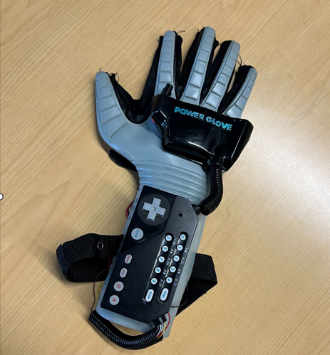
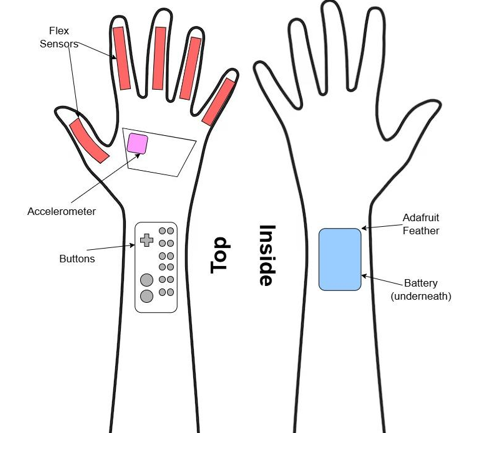
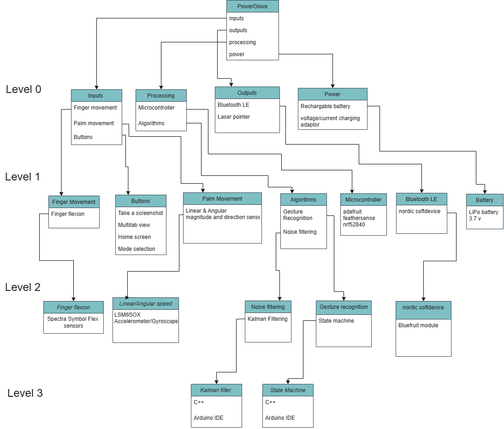

# PowergloveV2 - Sponsored by Lockheed Martin

Demo Video

The reimagined Power Glove enhances human-computer interaction by introducing a touchless interface that translates intuitive hand gestures into precise digital input. Designed to replace the traditional mouse, it enables seamless control through natural motion, offering a more ergonomic, immersive, and futuristic method of interaction. Users can simply connect the glove to their computer via Bluetooth and control it using hand movements. The glove tracks hand motion to move the cursor and detects gestures to trigger commands such as click, zoom, scroll, and more.

The system integrates an accelerometer/gyroscope IMU to track hand movement and orientation on three axes. Flex sensors embedded in each finger detect varying degrees of flexion, which, when combined with motion and orientation data, enable functions such as clicking, dragging, zooming, scrolling, and activating a laser pointer. Additional buttons on the glove provide quick access to common keyboard shortcuts like Ctrl+C and Ctrl+V. The Adafruit Feather nrf52840 Sense microcontroller was used for its processing speed, bluetooth LE, and usb charging capabilities.

||.png)
|:--:|:--:|

# Design 

Parts:

- [Adafruit feather nrf52840 sense](https://learn.adafruit.com/adafruit-feather-sense/overview)
- [LSMD6SOX IMU](https://learn.adafruit.com/lsm6dsox-and-ism330dhc-6-dof-imu/overview)
- 5x Flex sensors 
- Buttons 
- USB-C charging port
- Rechargeable 3.7 V LiPo battery
- 5x 400k ohm resistors
- 2n7000 mosfet transistor
- 10 uf capacitor
- 650 nm  5 mW laser

Layout: 

Level Diagram:

# Project google drive folder
https://drive.google.com/drive/folders/1QBTlvf5KhOVl-Dzjxu-7hFhMazjApdm0?usp=sharing

# Arduino IDE Setup
https://learn.adafruit.com/adafruit-feather-sense/arduino-support-setup

Follow steps below depending on OS

# For Windows and Linux

1. Download Arduino IDE at https://www.arduino.cc/en/Main/Software
2. Start Arduino IDE and go to preference and add https://adafruit.github.io/arduino-board-index/package_adafruit_index.json as an 'Additional Board Manager URL'
3. Restart the IDE
4. Open Board Manager in the Tools -> Board and install 'Adafruit nRF52 by Adafruit'
5. After install use Tools -> Board to select Adafruit Feather nRF52840 Sense 

# For Windows Only

Windows Users will likely need to install the following two links
Select all options when installing below
https://learn.adafruit.com/adafruit-arduino-ide-setup/windows-driver-installation
CP210x Windows Drivers option is what I had to choose
https://www.silabs.com/developer-tools/usb-to-uart-bridge-vcp-drivers?tab=downloads

# For Linux Only 

Follow above windows steps and then follow below if python3 is not installed already

Linux Users will likely need to install https://www.silabs.com/developer-tools/usb-to-uart-bridge-vcp-drivers

1. Run `$ sudo apt-get install python3`
2. Run `$ pip3 install --user adafruit-nrfutil`
3. Add to path if needed
4. Ensure adafruit-nrfutil can be executed in terminal by running `$ adafruit-nrfutil version`

# Library Manager install requirements

On the left click of the Arduino IDE click the library manager(book icon) and install the following libraries. Names should be exact to name in library manager

Arduino_APDS9960
Arduino_LSM6DS3
Adafruit APDS9960 Library
Adafruit BMP280 Library
Adafruit BusIO
Adafruit LIS3MDL
Adafruit LSM6DS
Adafruit SHT31 Library
Adafruit Si7021 Library
Adafruit Unified Sensor
LSM6

# How to run on Arduino IDE

After steps above plug in the Adafruit Feather nRF52840 Sense and Upload your code with the Arduino IDE.

Ensure COMM port is correct for the connection to the board.

## Debug
If updating the board user might need to open up glove and click the button on the board to update what it runs.

